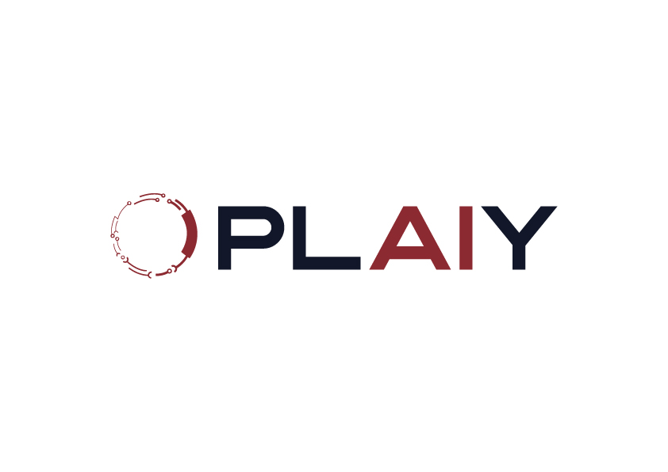
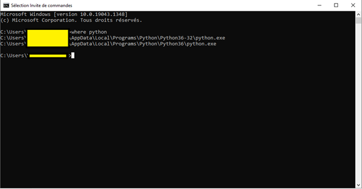
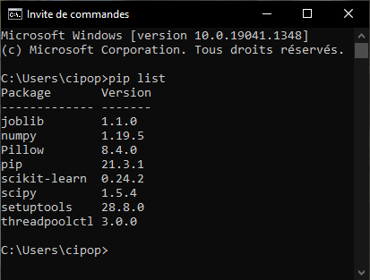
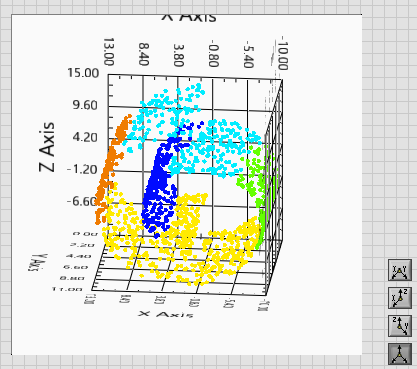
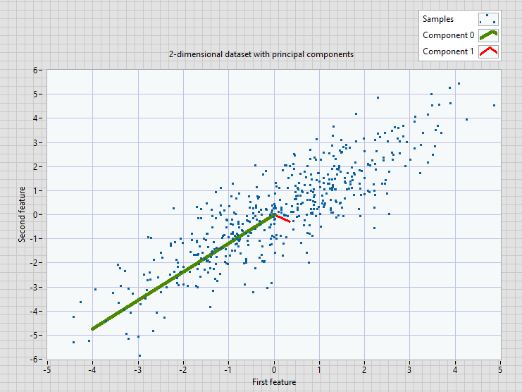
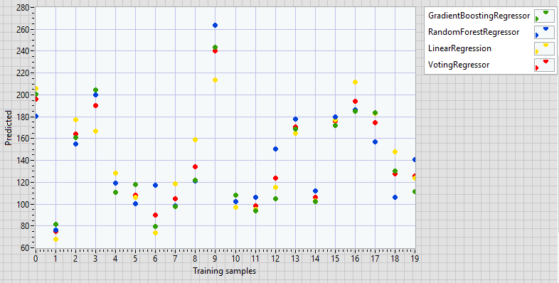
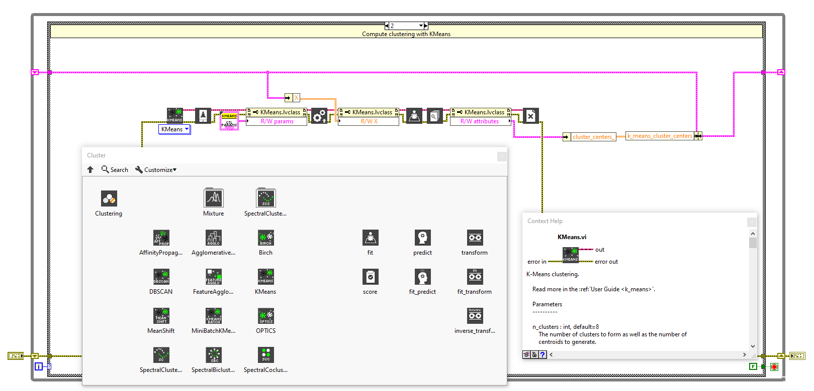

       

Let’s make Machine Learning easy with scikit-learn on LabVIEW.

TDF team is proud to propose for free the scikit-learn library adapted for <b>LabVIEW </b>in open source.
It features various classification, regression and clustering algorithms including support vector machines, random forests, gradient boosting, k-means and 
DBSCAN, and is designed to interoperate with the Python numerical and scientific libraries NumPy and SciPy from the famous scikit-learn Python library. 

This library is organized in 3 distinct parts : 

<ul>
1 - a set of data for users to play with
</ul> 
<ul>
2 - a set of preprocessing functions which aim to work on the data before using them in a model (this is often necessary because the raw data cannot be exploited as it is)
</ul>  
<ul>
3 - many machine learning models that we can train. These models are classified in several categories
</ul>  
<ul>
  <ul>
    3.1 - Supervised learning models (these are machine learning models that consist in learning a prediction function from annotated examples)
  </ul>
</ul>
<ul>
  <ul>
    <ul>
      3.1.1 - Regression models (these are models that must predict values)
    </ul>
  </ul>
</ul>
<ul>
  <ul>
    <ul>
      3.1.2 - Classification models (models that classify elements)
    </ul>
  </ul>
</ul>
<ul>
  <ul>
    3.2 - Unsupervised learning models (unsupervised learning refers to the situation of automatic learning where the data are not labeled)
  </ul>
</ul>
<ul>
  <ul>
    <ul>
      3.2.1 - Clustering models (these are models that group data by similarity)
    </ul>
  </ul>
</ul>
<ul>
  <ul>
    <ul>
      3.2.2 - Dimension reduction models (these are models that reduce the number of variables in the training data, in order to obtain more efficiency in terms of results and analysis time)
    </ul>
  </ul>
</ul>

## Installation

Library works with  <b>LabVIEW 2020 </b> and Python 3.6.   
To install it download plaiy-1.0.0.6.vip file and execute it. It will install LabVIEW package, Python 3.6 (X64) and all the package needed to run.  

If you want to use the sources you have to install Python 3.6 and all the packages.   

https://www.python.org/ftp/python/3.6.5/python-3.6.5-amd64.exe   
https://www.python.org/ftp/python/3.6.5/python-3.6.5.exe

Caution, if you use LabVIEW 32 check Python32 installed, if you use LabVIEW 64 check Python64 installed.
You can check on the windows command prompt (search then tape cmd and enter).

Then verify if modules "scikit-learn", "scipy", "numpy", "pillow" and "sys" are installed. 
To do this, enter the command "pip list" in the command prompt. 

If one or more modules are not installed enter the command "pip install module_name" in the command prompt.

## Images

  
   
   

   
   

